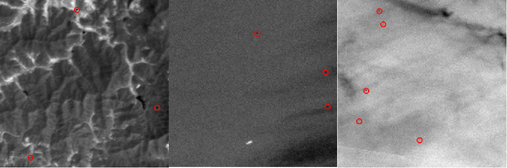
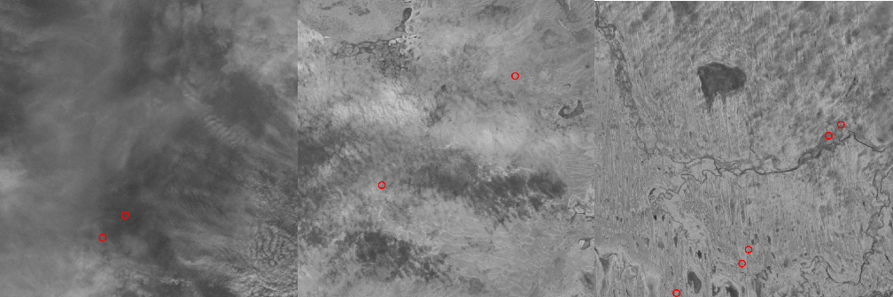
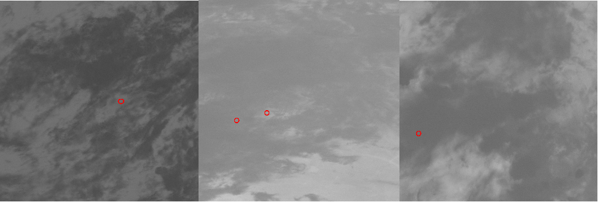
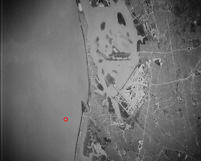

# CSIG比赛
Docker image: codalab/codalab-legacy:py312 
Competition Report: https://jinsight-cup.github.io/JinSight-ChallengeV3/index.html

赛道一：红外视频卫星空中动目标检测
赛道一的主要任务是对视频中的红外小目标的质心进行预测，附加任务是对目标进行跟踪。参赛队伍根据红外小目标图像特点自行设计相关算法，使用主办方提供的数据集进行模型训练，最终以召回率（Recall）、精确率（Precision）和 F1 分数作为评价指标，以及轨迹完整度和轨迹准确度作为附加评价指标，衡量参赛队伍算法模型的性能。

# 数据集简介
赛道一数据集简介
竞赛数据集由国防科技大学与武汉大学联合开发，包括：基于热红外卫星的 IRAir 数据集、基于 Landsat 卫星的 IRSatVideo-LEO 数据集、基于高分四号卫星的 IRSatVideo-GEO 数据集，以及实测卫星热红外视频数据，共 1400 段视频序列（1000 段用于训练，200 段用于验证，200 段用于测试）。比赛开始前，将发布训练集和验证集视频及掩码标注；进入评测阶段时公布测试集视频，测试集标签不公开。

## 数据集	数据集简介
IRAir	数据来源：热红外 SDG 卫星一号图像，仿真目标
目标特点：飞机，低轨，暗目标
分辨率：256×256	IRAir 

IRSatVideo-LEO	数据来源：Landsat 卫星图像，仿真目标
目标特点：低轨，亮目标，短波红外
分辨率：1024×1024	IRSatVideo-LEO 

IRSatVideo-GEO	数据来源：高分四号卫星图像，仿真目标
目标特点：地球同步轨道，中波红外，弱目标
分辨率：742×733（平均）	IRSatVideo-GEO 

实测热红外视频数据	数据来源：实测卫星热红外视频
目标特点：长波
分辨率：512×640	实测热红外视频数据 

# 挑战赛评价方式

## 赛道一评价方式
本次挑战赛赛道一的算法评价指标为召回率（Recall）和精确率（Precision），附加评价指标为轨迹完整度、轨迹准确度。算法最终评分结果由 F1 分数和附加分数组成。

### 核心指标公式
\[
Recall = \frac{TD}{AT}, \quad Precision = \frac{TD}{TD + FD}
\]

\[
F1 = \frac{2 \times Recall \times Precision}{Recall + Precision}
\]

\[
TrackCompleteness = \frac{NTA}{N}, \quad TrackAccuracy = \frac{NTA}{NA}
\]

### 附加得分项
| 附加得分项 | 阈值一 | 阈值二 | 阈值三 |
| :--- | :--- | :--- | :--- |
| 轨迹完整度得分 | ≥25%: +2分 | ≥35%: +3分 | ≥50%: +5分 |
| 轨迹准确度得分 | ≥55%: +2分 | ≥65%: +3分 | ≥80%: +5分 |

最终得分为 F1 分数 × 100 + 附加得分，满分为 110 分。

# 结果提交

## 结果提交详见参赛结果与提交结果说明.pdf，赛道一的部分